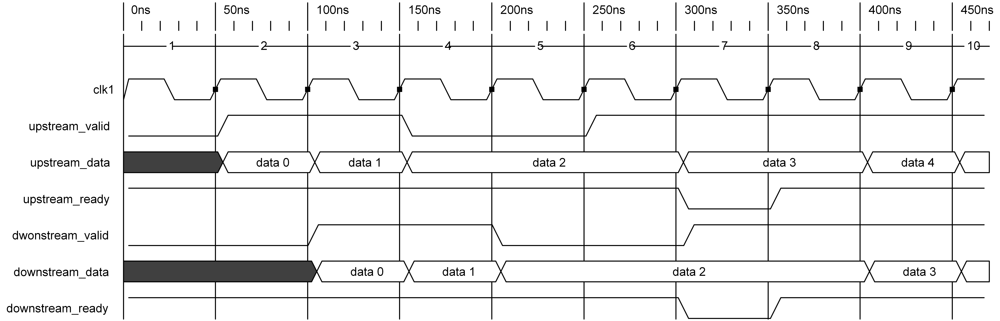
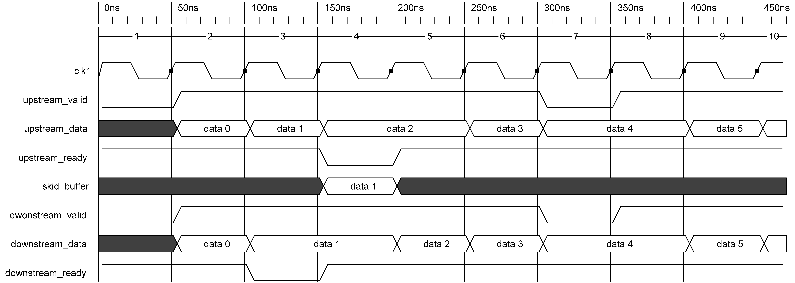
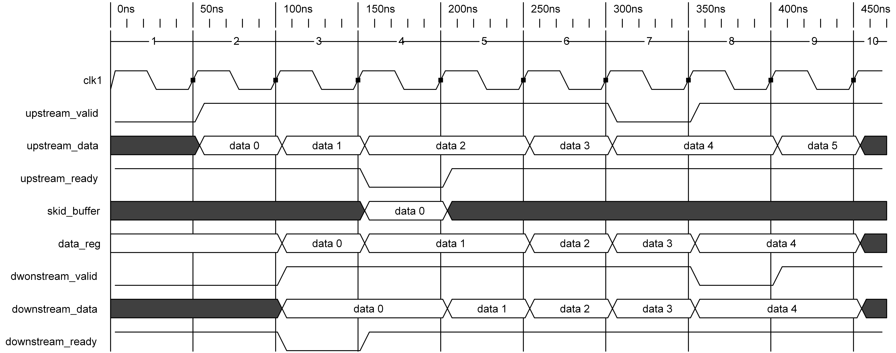
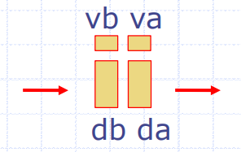

# handshake_protocol

第一部分包括valid打拍、ready打拍以及valid_ready均打拍的verilog实现代码及波形图

第二部分是在BSV环境下设计的三种FIFO: Pipeline FIFO, Bypass FIFO, Conflict-Free FIFO

这三种FIFO分别与三种打拍方式对应，三种**深度为1**的FIFO行为与三种打拍方式完全一致。

## Handshake Protocol in Verilog

### Valid Pipeline



在valid打拍中，上游输入的valid及其data会在下一个时钟上升沿输出，下游输入的ready信号会在本时钟周期内输出，**因此在valid打拍中ready传播通路为关键路径**。

### Ready Pipeline



在ready打拍中，上游输入的valid及其data会在本时钟周期内输出，下游输入的ready信号会在下一个时钟上升沿输出，**因此在ready打拍中valid传播通路为关键路径**。

> 在ready打拍中，因为ready的延迟传递导致在下游节点无法消耗数据时，上游节点判断数据已经被当前节点消耗，所以会产生数据丢失的问题，需要引入SKID buffer。

### Valid-Ready Pipeline



在valid-ready打拍中，上游输入的valid及其data以及下游输入的ready信号均会在下一个时钟上升沿输出，因此可以看作是valid打拍和ready打拍的串联设计。**因此ready和valid的关键路径都会终止于本级的寄存器**

> 为保证该模块的输出为寄存器输出，可以把valid串联在ready后级

对该电路的进一步优化可以通过复用两个模块中的使能信号逻辑实现。

## Handshake Protocol in BSV

在BSV的FIFO中，数据的输入和输出分别通过enq和deq实现

### Pipeline FIFO

当FIFO满(对于深度为1的FIFO，表示寄存器中存在有效数据)时，能够在输出当前寄存器值(deq)的同时进行enq，把当前输入存入寄存器，对于该过程可以描述为:

$deq < enq$

```Makefile
\$ make pipeline
```

### Bypass FIFO

当FIFO空(对于深度为1的FIFO，表示寄存器中不存在有效数据)时，能够在enq的同时把该数据deq，即不通过寄存器直接输出该数据(称为bypass)，对于该过程可以描述为:

$enq < deq$

```Makefile
\$ make bypass
```

### Conflict-Free FIFO



enq和deq永远能够同时执行，与bypass的无延迟传输不同，此处数据enq发生在vb，deq发生在va，该情况下深度为1的FIFO行为与valid-ready均打拍的流水线一致。

$enq\ \ CF \ \ deq$

```Makefile
\$ make cfnc
```